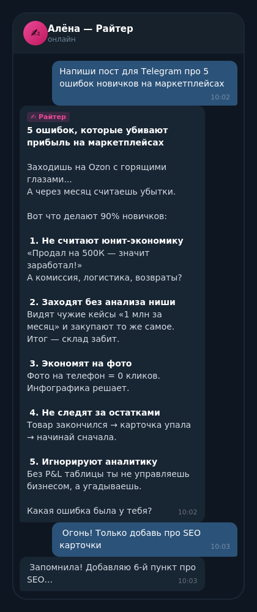
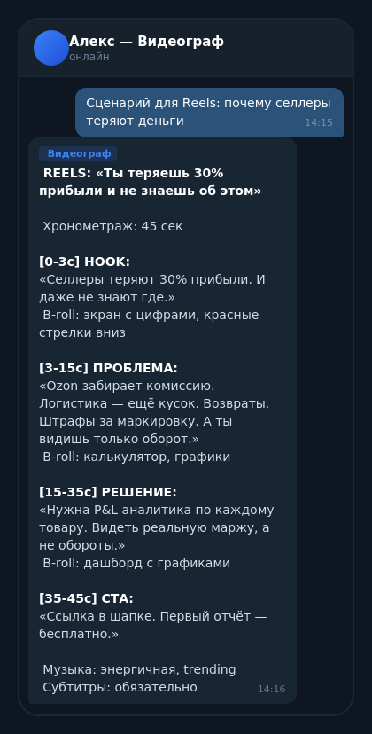
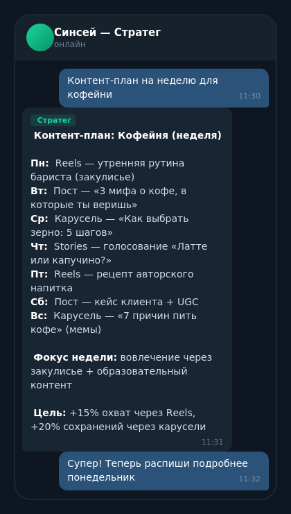

# 🏭 AI Content Factory

> Команда AI-агентов для создания контента — посты, видео, карусели, стратегия.
> Установка в один клик. Работает 24/7 на вашем сервере.

**Автор:** [Marat](https://t.me/Mticool) | Создано на базе [OpenClaw](https://openclaw.ai) | [Лендинг](https://mticool.github.io/ai-content-factory/landing/)

---

## Что это?

AI Content Factory — это готовая система из **6 AI-агентов**, которые работают как команда:

| Агент | Роль | Что делает |
|-------|------|------------|
| 🎯 **Оркестратор** | Координатор | Распределяет задачи, контролирует качество |
| ✍️ **Райтер** | Тексты | Посты, статьи, Threads, Telegram, копирайтинг |
| 🎬 **Видеограф** | Видео | Сценарии YouTube, Reels, Shorts, TikTok |
| 🧠 **Стратег** | Стратегия | Смыслы, оффер, кастдев, прогрев, запуски |
| 🎨 **Дизайнер** | Визуал | Карусели, обложки, AI-картинки |
| 📊 **Аналитик** | Качество | Оценка контента, метрики, learning loop |

## Как это выглядит

<div align="center">
<table>
<tr>
<td align="center"><br><b>✍️ Райтер</b> — посты</td>
<td align="center"><br><b>🎬 Видеограф</b> — сценарии</td>
<td align="center"><br><b>🎯 Стратег</b> — планы</td>
</tr>
</table>
</div>

## Как это работает

```
Ты пишешь в Telegram → Оркестратор понимает задачу → 
Делегирует нужному агенту → Агент создаёт контент в твоём стиле →
Аналитик проверяет → Ты получаешь готовый результат
```

### Pipeline
```
💡 ИДЕЯ → 🔍 РЕСЁРЧ → 📋 БРИФ → ✏️ ДРАФТ → 👀 РЕВЬЮ → ✅ ОДОБРЕНИЕ → 📤 ПУБЛИКАЦИЯ
```

### Learning Loop — система учится
- 👍 Понравилось → запоминает паттерн
- 👎 Не понравилось → избегает в будущем
- ✏️ Поправил → создаёт правило навсегда

---

## Быстрый старт (5 минут)

### Требования
- VPS сервер (Ubuntu 22.04+, от 1 GB RAM, ~$4-7/мес)
- Anthropic API ключ ([console.anthropic.com](https://console.anthropic.com))
- Telegram-бот (бесплатно через [@BotFather](https://t.me/BotFather))

### Установка

```bash
# 1. Установить OpenClaw (если ещё нет)
curl -sSL https://openclaw.ai/install.sh | bash

# 2. Установить Content Factory
curl -sSL https://raw.githubusercontent.com/Mticool/ai-content-factory/main/install.sh | bash
```

Скрипт спросит:
1. Как тебя зовут?
2. Название бренда/проекта?
3. Ниша?
4. Telegram-бот токен?
5. API ключ?

И всё настроит автоматически.

### Ручная установка

См. [docs/MANUAL-INSTALL.md](docs/MANUAL-INSTALL.md)

---

## Настройка под себя

### Бренд (обязательно)
Заполни 3 файла — и все агенты будут писать в твоём стиле:

| Файл | Что заполнить |
|------|---------------|
| `brand/profile.md` | О тебе, бренд, УТП |
| `brand/voice-style.md` | Тон, стиль, обращение |
| `brand/audience.md` | Целевая аудитория, боли |

### Notion (опционально)
Подключи Notion для контент-плана и аналитики. См. [docs/NOTION-SETUP.md](docs/NOTION-SETUP.md)

### Дополнительные инструменты (опционально)
- 🖼️ Генерация картинок (LaoZhang / OpenAI)
- 📹 Генерация видео (Veo)
- 📊 Парсинг конкурентов
- 📤 Автопостинг (Threads, VC.ru)

---

## Примеры использования

**Написать пост для Telegram:**
> Напиши пост про 5 ошибок начинающих предпринимателей

**Сценарий для Reels:**
> Сделай сценарий рилса: почему 90% стартапов закрываются

**Карусель для Instagram:**
> Карусель на 7 слайдов: как выбрать нишу для бизнеса

**Стратегия запуска:**
> Разработай стратегию прогрева для запуска курса

**Разбор конкурента:**
> Проанализируй контент @competitor в Instagram

---

## Структура проекта

```
ai-content-factory/
├── agents/                    # Агенты
│   ├── orchestrator/          # Оркестратор (главный)
│   ├── writer/                # Райтер (тексты)
│   ├── video/                 # Видеограф (сценарии)
│   ├── strategist/            # Стратег
│   ├── designer/              # Дизайнер
│   └── analyst/               # Аналитик
├── brand/                     # Твой бренд (заполняешь ты)
│   ├── profile.md
│   ├── voice-style.md
│   └── audience.md
├── learning/                  # Обучение (заполняется автоматически)
├── shared/                    # Общие ресурсы
├── scripts/                   # Установка и утилиты
├── docs/                      # Документация
└── install.sh                 # Установка одной командой
```

---

## Стоимость

| Компонент | Цена |
|-----------|------|
| Content Factory | **Бесплатно** (open-source) |
| VPS сервер | ~$4-7/мес |
| Anthropic API | ~$20-50/мес (по использованию) |
| **Итого** | **~$25-60/мес** |

Это дешевле одного копирайтера, а у вас целая команда 24/7.

---

## FAQ

**Q: Нужно ли уметь программировать?**
A: Нет. Установка автоматическая, общение через Telegram.

**Q: На каких языках работает?**
A: Русский и английский. Можно адаптировать под любой язык.

**Q: Можно ли добавить своих агентов?**
A: Да, структура модульная. См. [docs/CUSTOM-AGENTS.md](docs/CUSTOM-AGENTS.md).

**Q: Данные остаются у меня?**
A: Да, всё работает на вашем сервере. Никакие данные никуда не отправляются (кроме API запросов к модели).

---

## Документация

- 📖 [Быстрый старт](docs/QUICK-START.md) — 5 минут до старта
- 📖 [Ручная установка](docs/MANUAL-INSTALL.md) — пошагово
- 📖 [Настройка Notion](docs/NOTION-SETUP.md) — контент-план и аналитика
- 📖 [Свои агенты](docs/CUSTOM-AGENTS.md) — добавить агента
- 📖 [Примеры](docs/EXAMPLES.md) — что можно попросить
- 📋 [Changelog](CHANGELOG.md)

## Поддержка

- 📱 Telegram: [@Mticool](https://t.me/Mticool)
- 💬 Чат поддержки: [скоро]

---

## Лицензия

MIT License. Используйте как хотите.

---

**⭐ Если полезно — поставь звезду на GitHub!**
